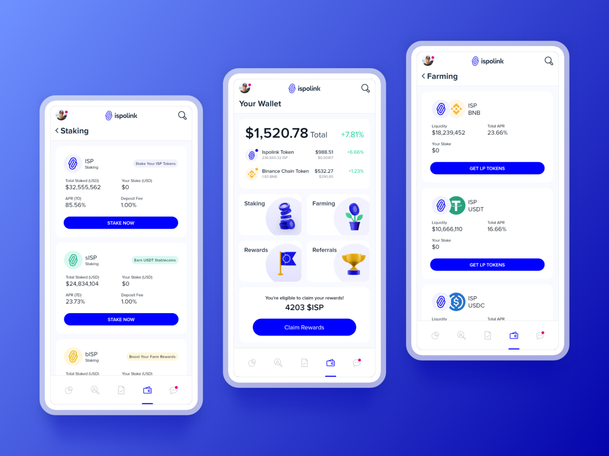

# React Native UI Challenge

## Introduction

This challenge is designed to test your skills in building React Native UI components.

## Target

Create a React Native UI Component that mimics the screen as shown in the image below. Focus on replicating the design details, including layout, color scheme, and typography.

 *(Design credit: [Dribbble](https://dribbble.com/shots/20172721-Mobile-Wallet-Ispolink-Job-Platform-Mobile-UI-Design))*

## Requirements

- **Theme:** Incorporating a theme is optional. If you choose to use a theme, ensure it is consistent across the component.
- **Static Component:** This challenge focuses on the UI aspect. You do not need to implement any functionality or logic behind the component.

## Submission Guidelines

DO NOT fork this repo. Please submit your code by email or messaging your hiring manager. Include a README in your project that explains how to run your React Native app. 

Good luck, and we're looking forward to seeing your implementation!
